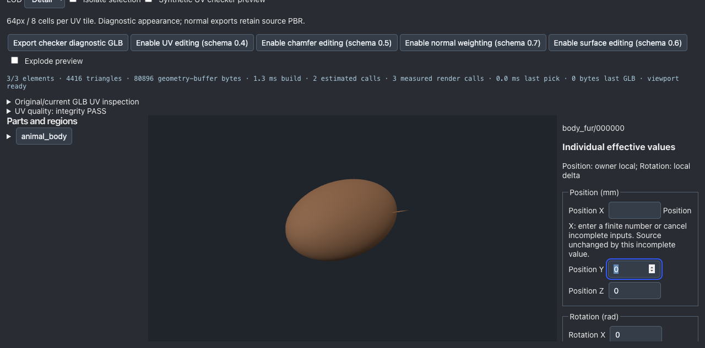

# 개별 요소·그룹의 미완성 숫자 입력

기준 `1db95ac6d1731423d0c1a9608a311831eb64e99c`. 변경 코드는 ElementEditor.tsx. 원본/사용자 변경은 보존하고 existing IR parser·editElement·editGroup·history·export 경로를 재사용했다. 스키마/기하/normal/UV/PBR 생성 및 검사 임계값은 변경하지 않았다.

## 재현과 구현

기존 numberField는 `Number(input.value)`를 사용해 빈 문자열을0으로 적용했다. 실제 Backspace로 generated strand X5mm를 비우자 저장 IR의 override가0mm가 되고 실제 GLB도 변했다. 원본 before/cleared 파일과 before.py 실행 기록을 보존했다. 기존 미완성 입력을 기본값으로 처리하지 않는다.

`valueAsNumber`가 비유한 값이면 미완성 문자열과 필드별 오류를 별도로 보관한다. 해당 값은 엔진에 전달하지 않고 JSON 저장과 모든 GLB 내보내기를 비활성화한다. 값을 고치거나 `Cancel incomplete inputs`로 마지막 유효 소스를 복구한다. 유효 숫자의 즉시 적용 방식은 유지한다. 여러 필드 중 하나만 복구하면 나머지 오류는 계속 차단한다. 선택/파일 교체 의도/Undo/Redo는 미완성 상태를 초기화한다. 잠긴 individual 요소의 숫자 입력을 비활성화했다.

입력을 비우는 의도는 기존 loadTicket을 갱신한다. 이미 진행 중인 export도 현재 입력 의도와 맞지 않으면 결과를 게시하지 않는다. 기존 mounted/project/ticket 검사와 실패 차단을 유지한다.

## 실제 검증

[증거](../benchmarks/modeling-slices-20261004/element-numeric-input)

- 실제 브라우저 Backspace/필드별 오류/JSON 저장·GLB 차단/Cancel/복구/복수 오류/그룹 Count/선택 변경/읽기 실패/JSON 재열기/추가 편집/잠금을 확인했다. 그룹을 선택하는 첫 자동화 버튼 매칭과 잘못된 JSON의 오류 문자열 기대는 도구 코드에서 수정했으며 실패 기록을 보존했다. 실제 파서는 SyntaxError를 `ProjectError: json: project`로 감싼다.
- native0.2 fixture는 기존 명시적 migration을 사용한 authored 구체와 strand3개다. baseline에서4개 메시 모두 watertight, 경계/non-manifold/퇴화/자기교차0. 실제 동물 해부학이나 groom 품질 인증이 아니다.
- generated 요소의 owner-local X5→6→7mm, 분리된 explicit 요소의 world X5→6mm를 저장·재열기·내보내기로 확인했다. owner는 Y65mm/rotation0이며 임의 회전 부모 지원 확대로 해석하지 않는다.
- Cancel은 원래 GLB와 바이트 일치. Undo/Redo 및 같은 저장 JSON 재열기도 전체 GLB 바이트 일치. file-preservation.json의8개 출력에서 local POSITION/NORMAL/UV/index를 포함한 BIN 전체, meshes/materials/scenes와 비대상 노드가 동일하다. 대상 matrix X=.006/.007m와 root sourceSpec의 선언 위치만 바뀐다. IR은mm/right-handed-y-up, GLB는m.
- 실제 export를 GLTFExporter 내부 barrier에서 기다리게 한 뒤 숫자를 비우고 완료시켰다. 다운로드0, 생성 geometry4/4 dispose, 최신 입력 오류 유지. race-result.json. 테스트 후 후크를 복원하고 브라우저를 닫았다.
- 실제 GLB6개 Khronos 및 독립 glTF Transform 검사 PASS. 현재 npm test122 files/842 tests PASS; check/benchmark/build PASS. 실행 명령과 종료값은 command-results.json. 새 source hash는 FINAL_RESULT.json.
- quality:gate/quality:production exit1. quality core rates와 release browser audit는 PASS, competitive의 기존 cooling DCC final infos23 조건은 실패한다. 원본 UV 삭제/dummy texture/임계값 완화는 없다. production dominance not-run. 이번 단계 Blender not-run: 입력 처리 수정이며 local mesh BIN이 그대로다. 이전 Blender receipt를 이번 실행으로 보고하지 않는다. 독립 인간 전문가 검수 not-run.

## 사용·재현·한계

개별 요소/그룹 선택 → 숫자 편집 → 유효한 값이면 기존 즉시 적용. 빈 값/미완성 수가 남으면 오류가 표시된다. 값을 고치거나 Cancel incomplete inputs를 누른 뒤 JSON/GLB를 저장한다. JSON을 Load JSON으로 다시 불러와 추가 수정할 수 있다. 유효한 중간 숫자는 여전히 즉시 적용되므로 이 작업은 전체 텍스트 입력을 하나의 최종 commit으로 바꾼 것이 아니다.

`npm run check`, `npm test`, `npm run benchmark`, `npm run build`, `npm run quality:gate`, `npm run quality:production`. before.py는 기준 코드에서 실행; after.py/extra.py는 현재 코드에서 Vite4179/agent-browser로 실제 조작한다. fixture.ts/explicit-fixture.ts는 입력을 만들고 file-preservation.py는 실제 원본과 출력을 비교한다. 파일 SHA는 결과 JSON에 기록한다. 큰 JSON/log는 gzip으로 무손실 보존하며 재현 전에 해제한다. Node24.13.1/macOS Apple M5, API/Claude0, 새 의존성0. 단계예산20분/진단 수리2/공개 archived evidence15MiB; raw 자료와 압축자료 용량은 ARTIFACT_STORAGE.json에 구분한다.

이번 범위는 ElementEditor 개별 요소·그룹의 즉시 편집 숫자 필드다. Domain Pack 생성 입력은 별도이고 PartInspector의 앞선 처리는 유지한다. 다음 한 작업은 Domain Pack 생성 화면의 빈 치수 입력이0으로 저장되는 경로를 실제 생성/실패 사례로 확인하는 것이다. 전체 플랫폼 납품 완료가 아니며 연속 Goal은 활성이다.
