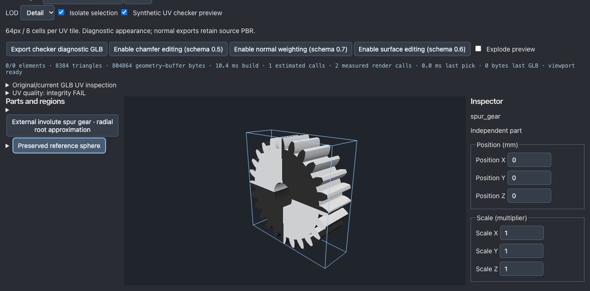
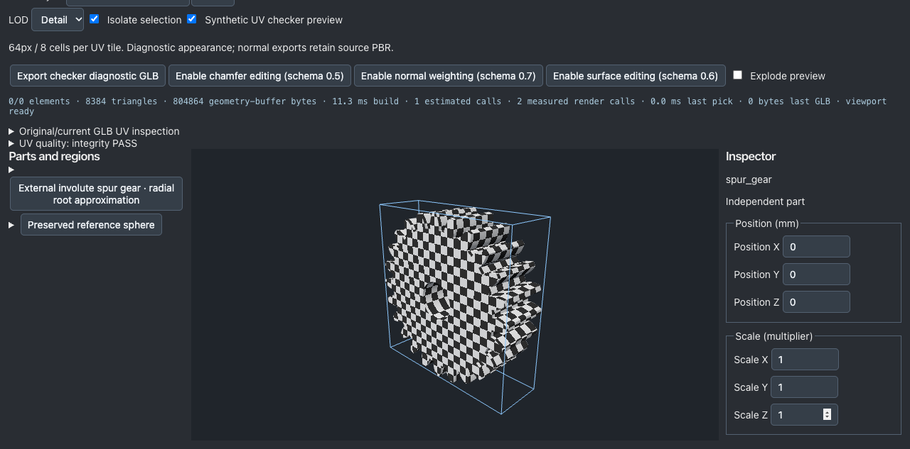

# 기어 로컬 투영 UV 타일 편집 체크포인트

기준 커밋: `abe372363644f1ea1d35e41bb7e6176f332f43fb`. 현재 코드 SHA와 입력·출력 파일 SHA는 [FINAL_RESULT.json](../benchmarks/modeling-slices-20261004/gear-projection-tile/FINAL_RESULT.json)에 연결한다.

## 구현과 범위

Native spur-gear 선택 → 기존 UV 0.4 명시적 마이그레이션 → `Local projection tile (mm)` → Apply → 저장/재열기/추가 편집/GLB 또는 선택형 Blender normal kit 내보내기. 1..1,000,000mm를 기존 선언형 uvScale=1000/tileMm에 연결했다. Cancel/Undo/Redo와 잠긴 부품 정책을 재사용한다. 다른 형상의 UV에 이 물리적 해석을 적용하지 않는다.

단위는 **부품 스케일 적용 전 로컬 투영축**의 간격이다. 실제 곡면 호 길이·atlas·패딩·texel density 보장은 아니다. 기존 스키마·컴파일러·기본 UV 생성·정점·normal 계산을 변경하지 않았다. 기본 작은/중간 기어의 UV 납품 차단은 명시적 수정 전 계속 유지된다.

## 진단과 두 수정

1. 작은/기본/큰 기어의 원래 UV 중 고정 double-area 1e-10 미만 삼각형은 2258/1490/0개였다. 실제 면적 0과 잘못된 월드 삼각형은 모두 0개였다. 로컬 meter 투영의 작은 UV 면적이 원인이었다. 명시적 10mm 타일(uvScale100) 편집 뒤 3개 사례 모두 이 검사에서 0개. 기존 5% 임계값과 톱니별 검사는 그대로다. 자동으로 모두 통과시키거나 원래 데이터를 교체하지 않았다.
2. 최초 uvScale 선언 시 런타임 객체 끝에 붙은 키가 저장 JSON의 정렬 순서와 달랐다. 재열기 전후 BIN은 같아도 GLB metadata 키 순서와 ZIP 바이트가 달랐다. **native normal-kit 경로만** 기존 serialize/parse로 소스를 정규화하고 editor selection을 분리했다. 일반 GLB 경로는 유지했다. 수정 후 최초 ZIP, 재열기 ZIP, 별도 새 브라우저 재열기 ZIP, 10→20→10mm ZIP 전체가 동일하다. 실패 당시 ZIP과 기록도 보존했다.

## 현재 검증

- npm test: 122 files, 841 tests PASS. npm run check / benchmark / build PASS. 최종 로그는 `*-final.log`.
- 세 크기 및 36톱니 별도 테스트에서 실제 생성 UV, 비대상 UV, POSITION/NORMAL/index, PBR와 계층을 확인했다. 실제 before/after GLB 검사는 preservation.json. 변경 UV는 Float32(oldUV*100)와 일치한다.
- 실제 브라우저 Apply/Cancel/Undo/Redo, 잘못된 0mm 차단, 잠금, 저장·재열기와 연속 편집 검증. 독립 새 세션에서 다운로드한 파일도 최초 ZIP과 바이트 일치: final-reopen-result.json. 자동화 다운로드 후크를 복원하지 않은 최초 도구 실패는 browser-hook-not-restored 기록으로 구분한다.
- 톱니 하나의 UV 20개 삼각형 변조: 전체 비율 약0.2385%지만 해당 톱니 20/294로 5% 초과하여 기존 critical feature 검사에서 차단했다. damaged-tooth 파일/보고서를 보존했다.
- Blender 5.2.1 LTS에서 최종 3개 kit의 실제 포함 importer를 실행했다. 첫 import 6 meshes의 입력 normal 오차 0°. .blend 저장·재열기·재저장 후 로컬 정점/UV/loop/normal 및 sourceJSON 보존. GLB 재export 6개 mesh 비교는 고정0.01° 기준 통과. 수치는 FINAL_RESULT.json. 일반 Blender 첫 import drift 해결로 주장하지 않는다.
- 최종 원본 GLB 3개와 재export GLB 3개 표준 검사 PASS. unused UV 정보는 삭제하지 않는다.
- quality:gate / quality:production 둘 다 exit1. 기존 cooling-service-assembly interchange 정보와 competitive 실패가 남는다. production dominance는 선행 실패로 not-run. 이번 UV 조작의 성공을 플랫폼 전체 납품 가능 주장으로 확대하지 않는다.

## 이미지와 재현

동일 camera/viewport/조명 checker 비교다. 형상 개선이나 실측 재질 정확도 증거는 아니다. fixed-camera.json에 카메라 기록과 동일성 검사를 남겼다.

증거 폴더의 diagnose.ts / fixtures.ts / preservation.py / damaged-tooth.ts / final-browser.py / final-native.py / final-reopen-native.py 및 실행 로그를 참고한다. 스크립트의 work 경로에 증거 폴더를 복사한 후 실행할 수 있다. `npm run gltf:validate -- <final-kit/model.glb> <final-kit/reexport.glb>`; 기본 네 명령은 위와 같다. Node24.13.1, macOS Apple M5, Blender5.2.1LTS 환경. 브라우저는 agent-browser로 실제 로컬 편집 화면을 조작했다.

## 한계와 자원

원래 단계 예산25분 + 진단된 metadata 순서 수정10분. 이번 체크포인트 정리는 그 예산 종료 후 별도 증거 정리이며 기한 내 완료로 소급하지 않는다. API/Claude 추가 호출0, 새 의존성0. 독립 인간 전문가 평가는 not-run. 소스 단위/UV의 실측 근거, atlas/텍스처 메모리 예산 인증, 제조 정확도 및 일반 DCC 편집의 IR 역변환은 지원하지 않는다. 이전 시도 파일은 당시 기록이며 final-*만 현재 kit의 증거다.

다음 한 작업: UV 실패 설명에서 실제 0면적과 고정 최소면적 미달을 구분하는 진단이 사용자에게 정확하게 표시되는지 재현하고 수정한다. 연속 Goal은 완료 처리하지 않는다.
