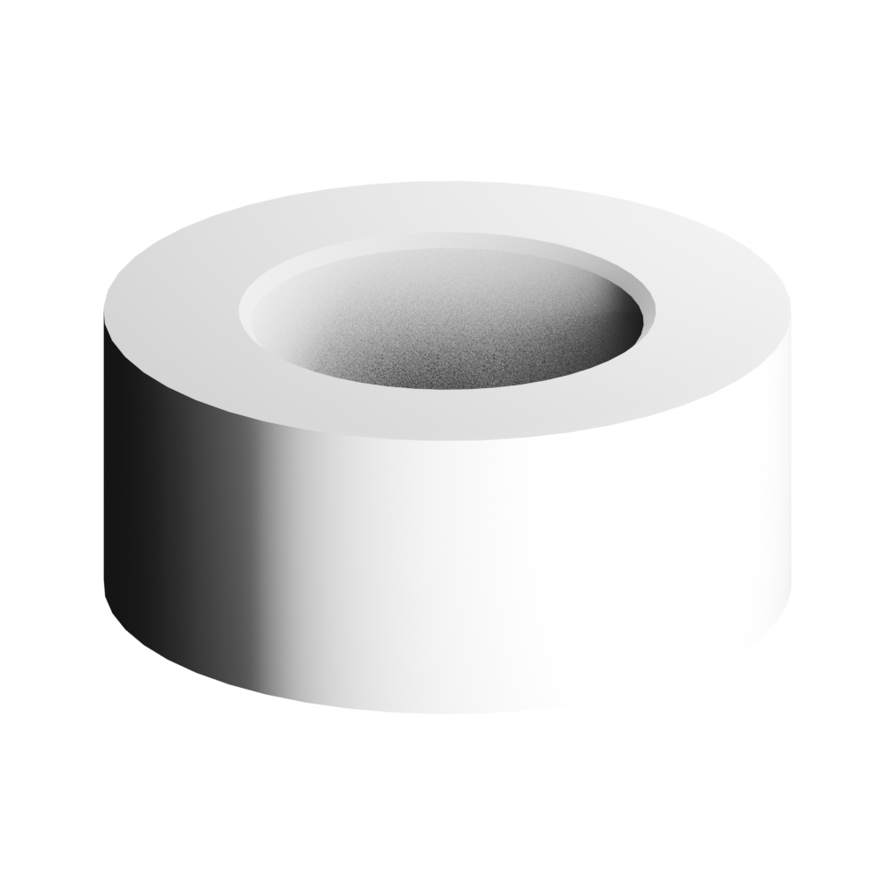

# 실제 회전체 모서리 chamfer — 2026-10-04

기준1931b597d1d2243a3a7174ba081818986cd76c90/compiler0.40.0.
기존 bearing-pack은 단면에 실제 chamfer 점을 생성하지만 일반 AssemblyIR 부품의 profile delta 편집은 점 추가가 불가능했다. 기존 lathe/profile/normal/UV/compiler를 유지하면서 명시적 corner 절삭 patch만 추가했다. 제조용 CAD/BREP 연산이 아니다.

## 연산과 사용법

component-patch0.2 안에 morphloom.lathe-corner-chamfer/0.1: pointIndex/setbackMm. 양쪽 이웃 선분을 따라 각각 setback만큼 이동한 두 점으로 원래 점을 교체한다. 직각에서는45° chamfer이며 일반각도에서45°를 보장하지 않는다. setback은 필렛 반경이나 절삭 면의 대각 길이가 아니다.

LOAD IR → 부품 클릭 → 회전체 단면 내부 점 선택 → chamfer 거리(mm) → Apply/Cancel → Undo/Redo → SAVE IR/GLB. 적용 후 amount는0으로 복원되고 점 번호가 바뀐다. 새 세션 LOAD IR로 실제 생성 profile을 다시 편집한다. 같은 amount를 새 모서리에 다시 적용하면 새로운 절삭이며 기존 chamfer의 파라미터 수정이 아니다. 원래 코너 복원은 Undo/원본 IR을 사용한다. 저장 파일에는 숨은 modifier/history가 없다.

명시적 raw scalar PBR/unscaled component의 볼록 내부 non-axis corner만 검증한다. frozen fidelity/visualPlan·projected/procedural finish·scale·seam/끝점·오목/직선·잘못된 버전/키·stale fingerprint·인접 선분 절반 이상 setback·결과128점/10000삼각형 초과·반경/높이 envelope 변경을 거부한다. 생성 후 기존 UV/closed topology 및 orientationConsistent 검사 통과 전 반환하지 않는다. 실패 source/batch는 변경하지 않고 임시 geometry/material은finally로 해제한다.

IR0.1의 profile/options를 보존하며 점 하나만 두 점으로 대체한다. 나머지 점·component ID·비대상 속성은 유지한다. point index는 현재 fingerprint에 묶이며 안정적 feature ID나 parametric modifier stack으로 승격하지 않는다. target position/normal/UV/index/count는 의도적으로 변경되고 texture mapping 보존은 주장하지 않는다. 자동 마모·필렛·범용 boolean·CAD 승인 지원 없음. 새 명령은0.1 patch/구버전 parser에서 거부되며 기존 입력 생성은 바뀌지 않는다.

## 현재 증거

첫 신규 성공 테스트는 기존 코드에서 연산 미지원으로 실패했다. 구현 후 실패1개는 collinear라 명명한 fixture[8,0]가 실제로 꺾인 모서리였기 때문이다. 인접점[8,-6],[14,6]의 중점[11,0]으로 fixture를 고쳤으며 판별 계약을 완화하지 않았다. 최초 실패 로그 보존.

현재 npm test118files/829tests PASS, check/benchmark/build PASS. 기존 assembly-edit 회귀 포함. source diff whitespace PASS.

small/default/large/solid의 setback0.25/0.5/1/0.5mm. 실제 GLB의 해당 두 ring을 잇는 chamfer 삼각형72/96/288/192개 확인. 최대 ring 좌표 차이는약1.39e-7mm로 기록된다. 1e-5mm는 Float32 기하 진단 기준이며 기존 byte preservation 계약이나 제조 공차를 대체하지 않는다. 반경/높이 envelope unchanged, closed topology pass. JSON 디스크 저장/재읽기, 전체 GLB 반복SHA exact, Khronos/WebIO PASS. 독립 WebIO 비대상 actual accessor/index/PBR/명명/부모/변환 exact. geometry-only measurement log의 optional clearcoat 미등록 경고는 재료 보존 검사가 아니며 별도 ALL_EXTENSIONS reader의 material 검사로 확인했다.

브라우저 default:0.5 입력 Cancel→0, Apply→실제 profile6점, SAVE IR/GLB 엔진 결과exact. Undo5점/원본exact, Redo6점/수정본exact. 새 세션 savedIR load→inner endpoint height5.5 유지/GLB exact. 같은 선택점에0.5 재절삭은 half-edge 규칙에서 거부/정상IR exact. Cancel 후 단면 높이5.5→5.4 수정 저장exact. 재열기 GLB SHA440ad6d6d1db98868e63ef22e13c05657a58e0de12caa0cf866bd54b97a074ad.

Blender5.2.1LTS 수정4종 import→reexport→reimport exit0. reexport 대상bushing normal4/4 기존0.01° PASS. 이번 first import normal payload 수치검사 not-run; 기존 비대상 sphere drift 해결 주장 없음. Blender 내부 새 정점 편집 실험 not-run; 실제 다시 열린 메시와 로컬 IR 편집은 별개다.

quality:gate/quality:production exit1. 기존 cooling UNUSED_OBJECT UV infos23 및 cross-domain benchmarkAccepted 차단 유지. dominance는upstream 실패로not-run. 전체 production-ready가 아니다. 원본 작업 폴더의 충돌 benchmark 보고서2개는 보존한다. API/Claude호출0.

## 중립 렌더와 재현

동일 fixed-space scale70/translation0,iso1024,부품isolate,사광 전후. camera/light/renderSettings/normalization exact. 내측 rim의 실제 chamfer 면이 보이며, 작성 진단 단면의 편집 검수다. 사진 실측 정확도·제조 적합성·전문가 승인 not-run.

증거 benchmarks/modeling-slices-20261004/lathe-chamfer-edit/manifest.json에 input/output SHA. macOS AppleM5/Node24.13.1/Python3.9.6/Blender5.2.1LTS. 30분/진단2/증거100MiB/API0 선작성 CONTRACT.md. 재현npm test -- --run tests/lathe-chamfer-edit.test.ts; npm run check; npm run benchmark; npm run build. 실행 원본TS들은work/lathe-chamfer-edit 상대 import와 기록된outputs 절대경로를 전제로 하며 다른 환경은 경로 조정 필요.

다음 한 가지: 이번 직각 코너 외의 사선 단면에서 실제 setback·법선·치수·오류 경계를 검증해 허용 범위의 근거를 넓힌다. 아직 임의 각도의 native render/DCC 검증 완료로 표시하지 않는다.
