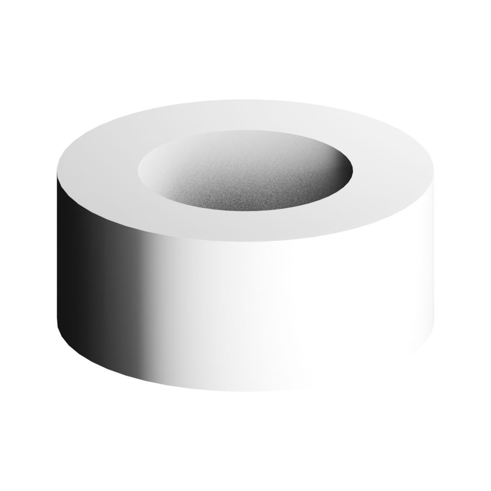
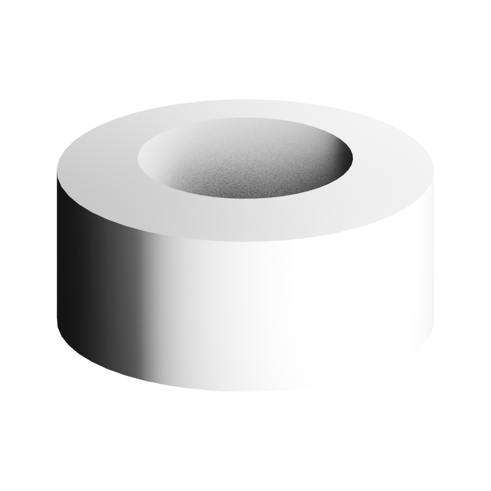

# 회전체 단면 편집 / Lathe profile — 2026-10-04

기준 c76a062ce1b0d101c9221c24c9ac9ba5f27c675f, compiler0.40.0. 기존 lathe-profile-deltas가 엔진에는 있었지만 사용자 UI에는 단면 점 편집 경로가 없었다. 새 기하 커널이나 IR 버전을 만들지 않고 기존 component-patch0.2를 사용한다.

## 사용자 동작과 지원 범위

LOAD IR → 부품 클릭 → 회전체 단면 점 번호 → Radius/Height(mm) → Apply/Cancel. Undo/Redo, SAVE IR, 새 세션 LOAD IR 후 추가 편집이 가능하다. 반경은 회전축에서의 거리, 높이는 component-local Y다. IR mm와 메시 m는 기존 엔진 변환을 따른다. 로컬 점 입력이며 부모 변환이나 세계 좌표 재해석이 아니다.

닫힌 첫/마지막 점은 같은 좌표로 갱신한다. 둘 다 상충되게 요청하면 거부한다. 음수/비유한 반경·높이, 새/삭제 점, 초과128점/10000삼각형을 거부한다. 절대값을 기존 delta 연산으로 변환한다. helper의 변경 없는 입력은 동일 IR로 반환하며 기존 patch no-op 거부는 그대로다.

명시적 raw scalar PBR만 검증했다. projected/procedural/micro-normal 또는 frozen fidelity/visualPlan을 차단한다. target POSITION/NORMAL/UV/index는 변경되며 target texture mapping 보존을 주장하지 않는다. 새 베벨·필렛, CAD/BREP, 제약 연동, arbitrary DCC inverse edit은 지원하지 않는다.

편집 후 대상 실제 기하를 기존 compileAssemblyGeometry/UV 경로에서 생성하고 analyzeTopology의 폐쇄·non-manifold·퇴화·자기교차 및 완료 여부 검사 후 commit한다. 임계값을 바꾸지 않았다. 실패하면 부분 적용하지 않는다. 임시 geometry/material은 finally로 해제한다. 기존 UI latest-intent/선택/원본 ownership/32단계 history를 재사용한다.

## 실행 증거

현재 npm test116files/824tests, check/benchmark/build PASS. related tests의 기존 assembly-edit 회귀 포함 PASS. 첫 helper 테스트는 구현과 함께 작성해 통과했으며, 구현 이전 red test를 실행했다고 주장하지 않는다. 부족한 기존 UI는 기준 커밋 코드로 확인했다. UI 편집 도구를 쓰는 Python 실행의 encoding 선언 누락은 파일 쓰기 전에 실패했고 교정했다; 제품 실패와 구분한다.

small/default/large/solid 각 실제 JSON 저장→disk 재읽기→GLB 반복 생성 wholeSHA exact, Khronos 및 독립 WebIO PASS. 독립 WebIO의 비대상 accessor bytes/index/PBR/명명/부모/변환 exact. 별도 POSITION 검사에서4종 상단 localY가 요청한1mm 증가했다. 실제 저장 증가1.0000001639127731mm는 Float32 진단값이다. 1e-5mm 비교는 새 진단 기준이며 기존 보존 byte 계약을 대체하지 않는다.

브라우저 default 높이6→7mm Apply/SAVE: IR과 actualGLB는 엔진 결과 exact. Undo 원본 exact, Redo 수정본 exact, 새 세션 savedIR load→7mm 유지 및 GLB exact,8mm 추가 수정, Cancel→7mm 복원. 점1을 점0과 같은8,-6으로 수정하면 기존 UV 전 퇴화 검사에서 차단되고8mm 정상 IR exact 보존.

브라우저 저장/재열기 GLB SHA eff9368cd352fcaa23b2c39f109eb3f9f150df2d023c67fdadf3eb7267dc6780.

Blender5.2.1LTS 수정4종 import→reexport→reimport 실행 exit0. reexport 대상 bushing normal은 기존0.01° 검사4/4 PASS. 첫 import normal payload 수치 검사 not-run; 기존 sphere drift가 해결됐다고 하지 않는다. 메시를 실제 다시 열었지만 이번에는 Blender 내 추가 정점 편집 실험 not-run이다.

quality:gate/quality:production exit1. 기존 cooling unusedUV infos23과 cross-domain benchmarkAccepted 차단 유지. upstream 실패로 dominance not-run. production-ready가 아니다. 기존 benchmark 보고서는 기존 입력/현재 compiler0.40의 증거이며 새 회전체 파일의 증거는 이 디렉터리에 따로 둔다.

## 렌더·파일·재현

동일 fixed-space scale70/translation0, iso1024 사광의 전후 비교. 카메라·조명·renderSettings 같으며 profile 높이 수정 때문에 bounds/framing은 의도적으로 달라진다. 작성 진단 단면이며 사진 원자료 정확도 검증 또는 자동 품질 향상을 주장하지 않는다.

증거 benchmarks/modeling-slices-20261004/lathe-profile-edit/manifest.json. 원본 실패/검사 로그 보존. macOS AppleM5, Node24.13.1, Python3.9.6, Blender5.2.1LTS. 30분/진단2/증거100MiB/API0 선작성 CONTRACT.md.
재현 npm test -- --run tests/lathe-profile-edit.test.ts; npm run check; npm run benchmark; npm run build. proof.ts/file-preservation.ts/dimensions.ts는 실제 work/lathe-profile-edit 상대 import 및 기록된 outputs 절대경로를 사용하는 실행 원본이다. 다른 환경에서는 경로 조정이 필요하다.

다음 한 가지: 단면 편집 실패 원인을 사용자가 수정할 수 있도록 현재 퇴화/교차 검사에서 점과 선분을 식별할 수 있는지 조사한다. 메시 기능 전체를 동시에 확장하지 않는다.
