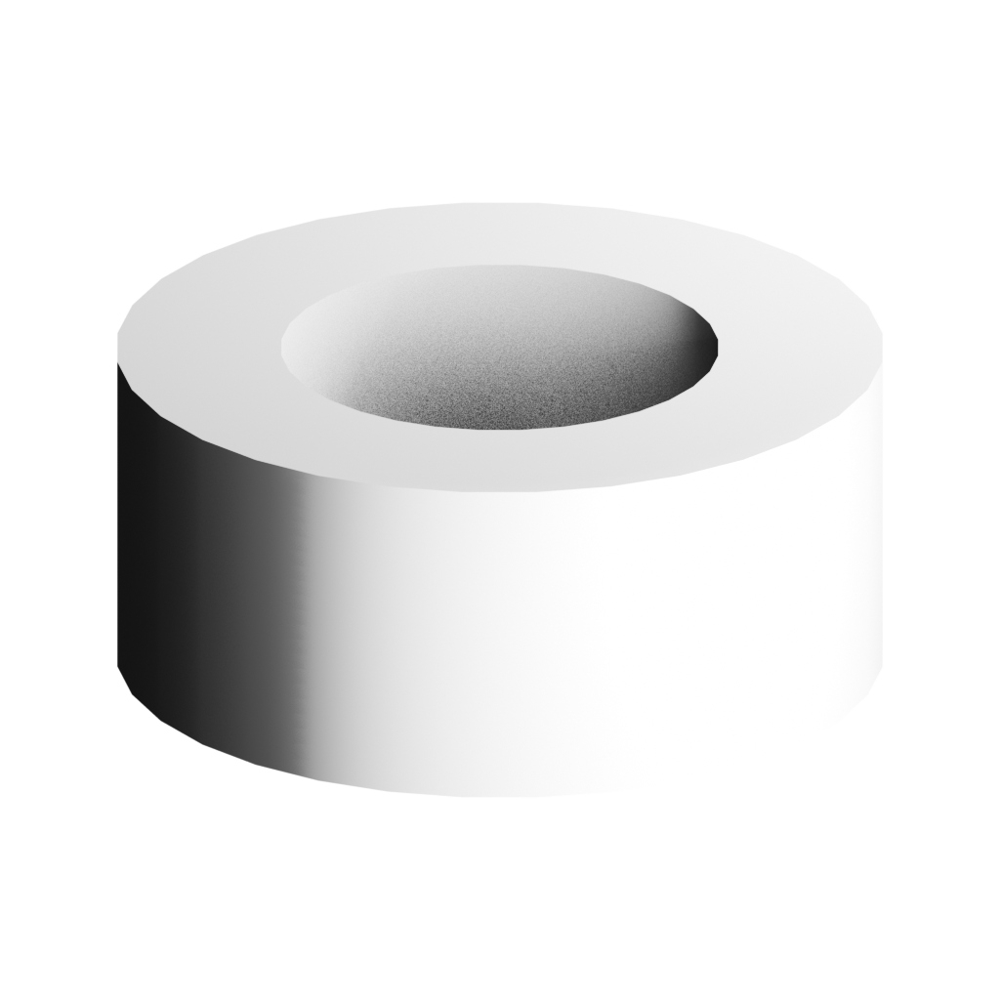

# 회전체 원주 분할 편집 — 2026-10-04

기준 HEAD d14fae197bfa1335dc3a1823eb158d971734bced, compiler 0.40.0.
AssemblyIR 0.1의 기존 segments를 실제 기하 생성 경로에서 편집한다. 커널 변경·자동 분할 증가는 없다.

## 계약과 구현

선작성 계약: outputs/lathe-segment-edit-20261004의 contract 자료. 작성된 분석 원주 대비 실제 정점 사이 현 중점 반경 오차 ≤0.03mm. 사진 실측·제조 공차를 의미하지 않는다. 30분, 진단 시도 최대2, 100000 target triangles, 증거1GiB, API0 예산이다.

component-patch 0.2 안에 morphloom.lathe-segments/0.1 연산을 추가했다. 정수3..512, 생성 예산, 원본 fingerprint를 검증한다. 0.1 patch·알 수 없는 버전/키·다른 op·과거 fingerprint·비지원 배치는 전체 거부한다. 원본 IR은 수정하지 않는다. 기존 no-op patch 거부를 유지한다. 변경 없이 SAVE IR은 가능하다.

현재 검증 범위는 명시적 raw scalar PBR lathe다. referenceProjection, procedural finish, nonzero micro-normal, frozen fidelity/visualPlan은 이유를 표시하고 차단한다. target POSITION/NORMAL/UV/index 및 분할 수는 의도적으로 바뀐다. target UV의 기존 텍스처 대응 보존은 주장하지 않는다. 비대상 accessor bytes, index, PBR, 이름·부모·변환은 독립 WebIO 검사에서 동일하다.

사용법: LOAD IR → 부품 클릭 → 회전체 원주 분할 입력 → Apply/Cancel → Undo/Redo → SAVE IR 또는 GLB. 새 세션 LOAD IR 후 추가 편집이 가능하다.

## 현재 실행 결과

| 작성 진단 사례 | 분할 | 실제 오차 전→후 mm |
|---|---|---|
| small |16→36|0.134503→0.026637|
| default |32→48|0.067414→0.029975|
| large |128→144|0.008434→0.006664|
| solid |64→96|0.016864→0.007496|

큰 사례와 solid의 원래 상태는 이미 계약을 충족했다. 이들의 성공을 원래 품질 실패로 표현하지 않는다. 모든 사례 bounds·closed topology 통과, 반복 생성 전체 GLB SHA 일치, 수정 JSON 디스크 재읽기 및 Khronos/WebIO 통과.

브라우저 기본 사례: draft48 취소→32, 적용→48, Undo/Redo의 실제 저장 IR exact, 새 세션 savedIR 재열기→48 및 GLB 전체 SHA exact, 추가64 수정, 잘못된32.5 Apply 오류 후 IR 보존. 초기 Apply/Cancel aria-label 셀렉터 실패는 실제 snapshot ref로 교정했다. 초기 draft 값만 확인한 wait는 성공 근거에서 제외했다.

브라우저 저장/재열기 GLB SHA: 506c17919a1cc7f4d09ea6564ca9edd5b768436c9661200ab08cbbcb27d429c5.

현재 npm test:114 files/818 tests PASS. npm run check, benchmark, build PASS. git diff --check PASS.
quality:gate 및 quality:production exit1. 내부 quality와 플랫폼 전체 competitive 결과는 별개다. 기존 cooling UNUSED_OBJECT TEXCOORD_0 infos23 차단을 유지하며 Blender cross-domain benchmarkAccepted=false가 남는다. production의 dominance는 앞 단계 실패로 not-run. 이 변경이 cooling 기하·UV를 바꾸지 않는다. 기존 proof 입력 fixture는 기존 compiler0.40과 동일하며, 새로운 회전체 파일은 별도 현재 증거다.

Blender5.2.1 LTS에서 수정4종 각각 첫 import→reexport→reimport 실행 exit0. reexport bushing normal 비교는 고정0.01° 기준4/4 통과. 이번 첫 import normal payload 수치 비교는 not-run; 이전 sphere normal drift 해결을 주장하지 않는다. 독립 전문가 평가·CAD/BREP·제조 승인 not-run.

## 렌더와 증거

고정 카메라에서 alpha 외곽 x119..904→117..906으로 변한다. 원주 근사 변경의 실제 실루엣 차이이며 mask 동일을 주장하지 않는다. 초기 비교가 framing 측정치를 설정으로 취급해 실패했으므로 camera/light/settings와 측정치를 구분해 확인했다.

동일 fixed-space(scale70, translation0), iso,1024, bushing isolate의 사광·wire 전후4장. actual-file-proof.json, file-preservation.json, native보고서, 실패한 최초 테스트 로그를 함께 보존했다.

증거: benchmarks/modeling-slices-20261004/lathe-segment-edit/manifest.json의 각 파일 SHA. 실행 환경 macOS AppleM5, Node24.13.1, Python3.9.6, Blender5.2.1LTS. 단위 IR mm, 생성 메시 m.
재현: npm test -- --run tests/assembly-lathe-segment-edit.test.ts; npm run check; npm run benchmark; npm run build. 파일 생성 진단 proof.ts/file-preservation.ts는 원래 work/lathe-segment-edit/ 위치와 outputs 절대 경로를 사용한 실행 원본이다. 별도 시스템에서는 import 경로와 출력 경로를 조정해야 한다.

첫 실패는 새 연산 미구현이었다. 구현 후 반복 same-value patch 성공을 기대한 테스트가 기존 no-op 거부 계약과 충돌했다. 제품 계약을 유지하고 기대를 reject로 고쳤으며, 지원되는 연속 편집48→64→48은 원본 수정 IR exact로 별도 검증했다.

전체 플랫폼 production-ready가 아니다. 다음 실제 병목은 사광에서 남아 있는 의도된 날카로운 rim의 표현 요구와 실제 크기 bevel 지원 여부를 조사하되, 원자료 없는 제조 디테일을 자동 추가하지 않는다.
