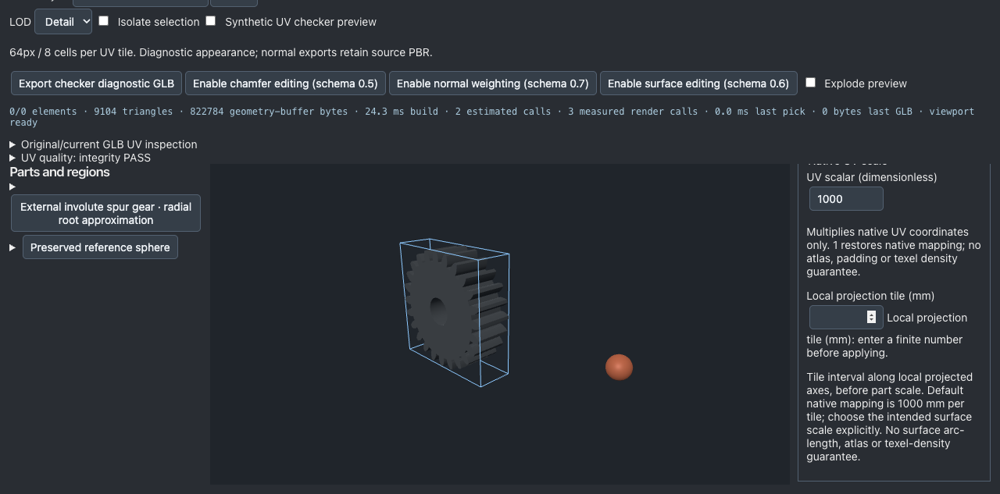

# 부품 숫자 입력의 미완성 값 처리

기준 `7646dc3fb72f41ac0bf0bba80fb35747ae6df9ac`. PartInspector의 숫자 입력만 수정했다. IR 스키마, 파서, 실제 기하/UV/normal 생성, 기존 범위와 검사 임계값은 유지한다.

## 실제 원인과 수정

기존 helper는 valueAsNumber가 비유한 값이면 변경을 무시했다. 실제 Backspace로10을 지우면 마지막 유효한1이 다시 나타나 필드를 자연스럽게 비우고 새 숫자를 쓰기 어려웠다. 초기 agent-browser `fill("")`는 DOM 값만 비우고 React 변경 이벤트를 전달하지 않아 빈 값/Apply 활성 상태를 보였으며, **이 초기 결과를 실제 사용자 이벤트 증거로 사용하지 않는다**. 실제 키 입력 기준선은 before-real-state.json: 마지막 유효1mm로 복원되고 scalar1000으로 적용되는 모습을 기록했다. 현재 코드와 비교할 때 baseline 컴포넌트만 임시 재현하고 final bytes를 정확하게 복원했다. source-restore-sha.txt와 FINAL_RESULT.json이 현재 코드를 연결한다.

수정 후 미완성 입력 문자열을 IR draft와 별도로 보존한다. 필드별 finite-number 오류를 보여주고 하나라도 남으면 Apply를 비활성화한다. 값을 고치거나 Cancel로 복구할 수 있다. UV scalar와 mm tile은 같은 선언값의 두 표현이므로 한쪽의 유효한 입력은 다른 쪽의 미완성 오류를 해제한다. 부품 전환/재열기의 기존 remount는 입력 오류 상태를 초기화한다. 잠긴 부품의 기존 비활성화도 유지한다. 범위·형상 유효성의 최종 판단은 기존 엔진 파서가 수행한다.

## 현재 검증과 파일

[증거](../benchmarks/modeling-slices-20261004/part-numeric-input)

- 실제 브라우저 Backspace: 빈 tile 유지/오류/Apply 차단. 두 필드를 비운 경우 한 필드만 고쳐도 나머지 오류가 적용을 막는다. Cancel 복원, UV 두 표현 양방향 복구, Lock 후 모든 부품 숫자 입력 비활성화 확인.
- 실제5mm 이동 → GLB/sourceJSON 저장 → JSON 재열기 → GLB 전체 바이트 일치 →6mm 추가 이동 성공. source IR은 선언한 위치와 사용자 선택 이외의 속성이 동일하다. 저장 시 UI가 첫 부품을 선택하므로 원래 kit의 전체 export selection2개를 그대로 기대하지 않는다.
- 실제 GLB 3개에서 모든 BIN chunk가 원본과 같다. POSITION/NORMAL/UV/index를 포함한 로컬 버퍼, meshes/materials/scenes 및 비대상 노드 전체를 보존했다. 대상 matrix의 X=.005/.006m와 root sourceSpec의 선언 위치만 달라졌다. 좌표계는 native IR right-handed-y-up, 입력mm/exportm. SHA는 file-preservation.json.
- Khronos 및 독립 glTF Transform 파서 검사3개 PASS. npm test122 files/842 tests PASS, check/benchmark/build PASS. 최종 check는 baseline 재현 후 복원된 코드에서 재실행했다. 전체 검사는 코드 변경이 없는 상태에서 반복하지 않았다.
- quality:gate/quality:production exit1: quality core rates와 release browser audit는 PASS지만 기존 cooling 최종 UV infos23이 competitive의 엄격한 DCC 조건을 충족하지 못한다. 임계값을 낮추거나 UV를 삭제하지 않았다. production dominance not-run. 전체 납품 완료를 뜻하지 않는다.
- 이번 단계 Blender not-run. 입력 처리 수정이며 로컬 실제 메시 bytes는 변하지 않았다. 과거 Blender 검증을 이번 실행으로 재사용하지 않는다. 독립 전문가 검수 not-run.

브라우저 검사 도구에서 빈 fill, 선택 단축키, selection 기대값, 잠금 boolean JSON 이중 디코딩을 수정한 실패 기록도 보존했다. 실제 잠금 필드가 모두 disabled였는데 문자열 `"true"`와 Python True를 비교했던 도구 실패를 제품 오류로 보고하지 않는다. 최초 GLB 보존 검사도 root sourceSpec의 의도된 위치 갱신과 target matrix를 전체 노드 불변으로 기대한 오류였다. 최종 검사는 변경을 정확하게 지정하고 그 외 값/bytes의 완전 일치를 요구한다.

## 재현과 한계

`npm test`, `npm run check`, `npm run benchmark`, `npm run build`, `npm run quality:gate`, `npm run quality:production`. browser.py는 Vite4179/agent-browser에서 실제 입력과 다운로드를 수행한다. before-real.py는 기준 버전 PartInspector로 실행해야 한다. file-preservation.py는 기록된 원본 kit GLB와 현재 다운로드 파일을 비교한다. Node24.13.1/macOS Apple M5. API/Claude0, 새 의존성0, 단계예산20분/진단2회/증거10MiB.

지원 범위는 PartInspector 숫자 입력이다. Domain Pack 생성 입력과 group/individual element의 즉시 적용 필드는 이번 수정 대상이 아니다. 다음 한 작업은 해당 즉시 적용 경로의 `Number("")=0`이 실제 형상을 예기치 않게 바꾸는지 재현하여 처리하는 것이다. 기하 품질 전반이나 production-ready로 주장하지 않으며 연속 Goal은 활성 상태다.

증거 자원 기록: 상세 UV 보고서를 포함한 raw archive64,709,825bytes는 초기10MiB 예산을 초과했다. 원본 work 자료를 보존하고 공개 archive의 상세 UV JSON과200KB 이상 JSON/log 자료를 무손실 gzip으로 저장했다. 원본 이름에 .gz가 붙은 파일은 gzip 해제 후 읽는다. ARTIFACT_STORAGE.json에 각 원본 SHA/용량/압축 용량을 기록한다. 이는 초기 예산을 지킨 것으로 소급하지 않는다. 압축은 파일 생성·UV 검사·판정과 관계없다.
