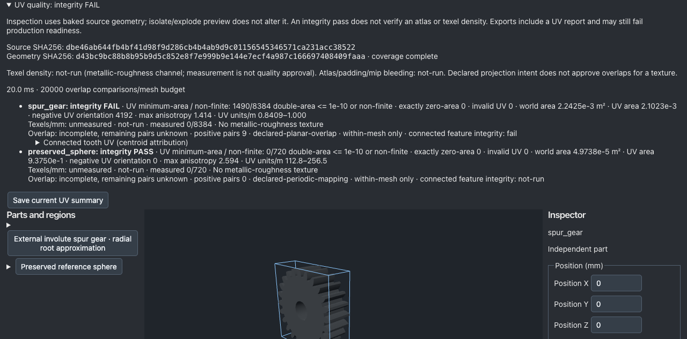

# UV 실패 원인 표시 수정

기준 `5b9644c1f0fa6eaed3e4877ac1d4858a488e80d8`. 이번 단계는 검수 UI와 오류 진단 수정이며 새 기하 개선으로 주장하지 않는다.

## 결함과 구현

실제 기본 기어의 검사 결과는 최소 double-area 기준에 걸린 UV 1490/8384, 정확히 0면적인 UV 0개다. 이전 화면/오류는 둘을 `degenerate`로만 표시했다. 기존 `degenerateUvTriangles`, `zeroUvTriangles`, 고정 `UV_DOUBLE_AREA_EPSILON=1e-10`을 재사용해 최소면적 미달 **또는 non-finite** 집계와 정확히 0면적 집계를 분리해 표시한다. 톱니에는 독립 zero 집계가 없으므로 최소면적/non-finite 집계만 보여준다. 판정·스키마·보고서 필드·정점·normal·UV·index·재질은 변경하지 않았다. 5%와 톱니별 차단을 유지한다.

## 현재 증거

[증거 폴더](../benchmarks/modeling-slices-20261004/uv-failure-reason)

- 실패 테스트 red.log에서 실제1490개/0개를 구분하지 못하는 메시지를 재현한 뒤 수정했다. 추가 테스트는 실제 UV 전체 붕괴와 NaN 입력도 계속 차단하는지 확인한다.
- 현재 npm test: 122 files / 842 tests PASS. check / benchmark / build PASS. command-results.json과 실행 로그를 보존했다.
- 실제 브라우저에서 JSON을 불러오고 UV 패널을 열어 새 설명을 확인했다. 기본 기어 GLB 내보내기는 계속 실패하며 정확한 이유를 표시한다. 진단 GLB 내보내기의 실제 다운로드 Blob을 저장하고 기존 입력 파일과 전체 바이트 일치를 확인했다. SHA는 browser-result.json. 첫 자동화 실패는 JS selector 따옴표 오류였으며 기록을 별도로 보존하고 도구 코드만 고쳤다.
- **현재 구현으로 실제 파일을 다시 검사**: 원래 default GLB 차단, 명시적10mm 수정 GLB 허용, 한 톱니 UV 변조 GLB 차단. 입력/소스 SHA와 실제 오류는 file-results.json. 과거 receipt를 새 성공 결과로 사용하지 않았다.
- quality:gate / quality:production exit1. 품질 core의 6개 rate=1과 release browser audit PASS; 이후 competitive의 엄격한 DCC final-delivery 조건에서 기존 cooling unused UV info가 남는다. 기존 domain 제작 근거 부족도 보고서에 남긴다. 의도적으로 만든 regressed fixture는 검사 안전성 사례이며 이번 회귀로 분류하지 않는다. production dominance는 선행 실패로 not-run. 임계값 변경/infos 삭제는 하지 않았다.
- Blender 재실행 not-run: 표시 수정 범위이며 actual GLB 바이트가 그대로다. 이전 Blender 검증을 이번 단계 실행으로 표시하지 않는다. 독립 전문가 검수 not-run.

## 재현과 다음 단계

`npm test -- tests/mesh-export-policy.test.ts tests/uv-quality.test.ts`, `npm run check`, `npm test`, `npm run benchmark`, `npm run build`, `npm run quality:gate`, `npm run quality:production`. Node24.13.1 / macOS Apple M5. 브라우저 스크립트 browser.py는 로컬 Vite4179와 agent-browser를 사용한다. files.ts는 이전에 보존한 실제 GLB를 현재 정책으로 재검사한다. 원본 파일의 위치와 SHA는 결과에 기록했다. 예산15분/2회 진단 수리/10MiB, 외부 API·Claude 호출0, 새 의존성0.

다음 한 작업은 cooling DCC 최종 파일의 unused UV가 어떤 원본 부품과 material 연결에서 발생하는지 분리 재현하는 것이다. 미사용처럼 보인다고 원본 UV를 삭제하지 않으며, 실제 내보내기/재열기 경계에서 정보 손실 없는 해결이 가능한지 조사한다. 연속 Goal은 활성 상태를 유지한다.
